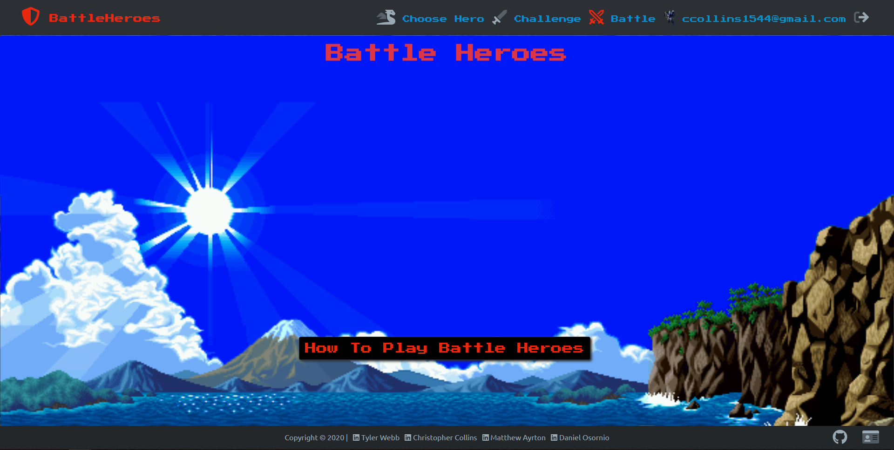

# Battle Heroes

Multiplayer battle game that gives players a chance to choose a hero and battle their friends. User friendly, simple, start to finish game play. 

# Using Battle Heroes
Access live site [here](https://battleheroes.io/)

# Features 

* Dozen apis to connect to MongoDB for game play manipulation. 
* Email players on sign-up and when challenged by other players. (nodemailer)
* Chat functionality (socket.io)
* User Authentication (passport local strategy)
* Animations (react-spring)

## Limitations 

These limitations and constrains apply:

* Turns are not kept track of yet.
* Requires page reload sometimes to get data updating. 

## Available Scripts

In the project directory, you can run:

### `npm start`

Runs the app in the development mode. 
Open [http://localhost:3000](http://localhost:3000) to view it in the browser.

The page will reload if you make edits. 
You will also see any lint errors in the console.

### `npm seed`

Seeds the database with heroes. 

### Credit
* [Tyler Webb](https://www.linkedin.com/in/tyler-webb-363843199/)
* [Christopher Collins](https://www.linkedin.com/in/ccollins1544/)
* [Matthew Ayrton](https://www.linkedin.com/in/matthew-ayrton-902550177/)
* [Daniel Osornio](https://www.linkedin.com/in/daniel-osornio-837547188/)